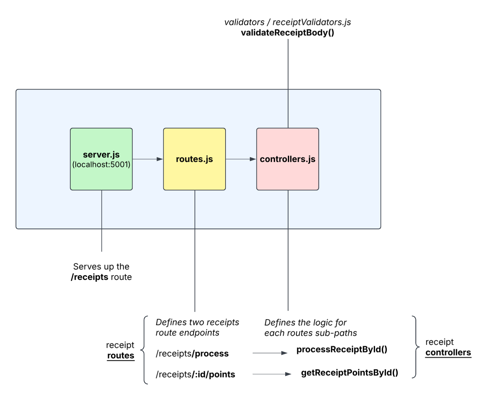

# Node Receipt Test

This NodeJS application was written by Karsen Hansen as a backend take-home assignment for Fetch. This server processes `receipts`, calculates `point` values based on provided rules, and stores points in memory associated by `id` for retrieval later.

## How To Run Server
### Docker Instructions
1. Open a new terminal window & build the NodeJS docker image with command:
> docker build -t karsen_nodejs_receipt_api .

2. Run the NodeJS app from the newly created docker image with command:
> docker run -p 5001:5001 karsen_nodejs_receipt_api

****NOTE:** All tests should execute (and pass) before the server starts but you can also run tests with command:

> docker run --rm karsen_nodejs_receipt_api npm test

3. Make requests to the receipt route endpoints:
    - */receipt/process*
    - */receipt/:id/points*

****NOTE:** `NodeJS Fetch Receipt API.postman_collection.json` file is included in the root of this project which can be imported into PostMan to run pre-made requests with provided JSON request body objects.

You can also make requests using curl:

    curl -X POST http://localhost:5001/receipts/process \
        -H "Content-Type: application/json" \
        -d '{
            "retailer": "Target",
            "purchaseDate": "2022-01-01",
            "purchaseTime": "13:01",
            "items": [
                {
                "shortDescription": "Mountain Dew 12PK",
                "price": "6.49"
                },
                {
                "shortDescription": "Emils Cheese Pizza",
                "price": "12.25"
                },
                {
                "shortDescription": "Knorr Creamy Chicken",
                "price": "1.26"
                },
                {
                "shortDescription": "Doritos Nacho Cheese",
                "price": "3.35"
                },
                {
                "shortDescription": "   Klarbrunn 12-PK 12 FL OZ  ",
                "price": "12.00"
                }
            ],
            "total": "35.35"
            }'

And to get points (make sure to copy id from previous requests response into the `id` of the following request).

    curl -X GET http://localhost:5001/receipts/<id>/points

4. View the point break-down from the POST request receipts in the terminal window where you started the server.

## What I would do differently

1. I would do this in TypeScript, though I haven't done a NodeJS app in TypeScript yet and didn't want this to be the learning project.

2. I would normalize responses for consistency and scalability.

3. I would add as many tests as I could think of - this project includes what I'd consider to be a fair baseline.
